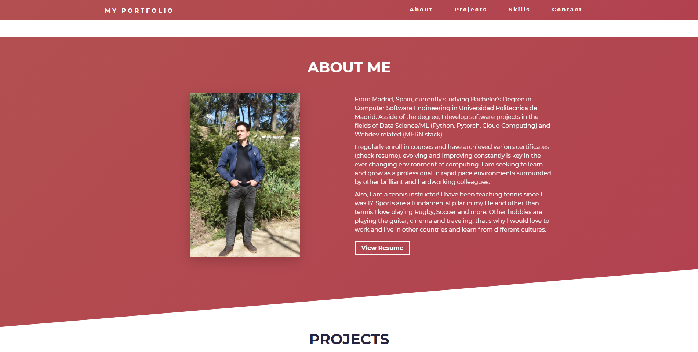

### Hi there, I'm Francisco Javier Serrano - aka [realfranser][gitHub] 👋

## I'm a computer engineering student, SDE Intern at Twilio Inc. and enjoy developing open source projects!!

Funfact: I like the digital nomad movement

### Connect with me:

[][linkedin]
[][instagram]

 

### My technologies:

#### Text editor:

 

#### OS:

 

#### Scripting

 

#### Web Dev

 

#### Cloud and DevOps

 

#### Data science and AI

 
 

### Check out my portfolio!
[][portfolio]

[instagram]: https://instagram.com/realfranser
[linkedin]: https://www.linkedin.com/in/fran-serrano/
[gitHub]: https://github.com/realfranser
[portfolio]: https://www.realfranser.com
